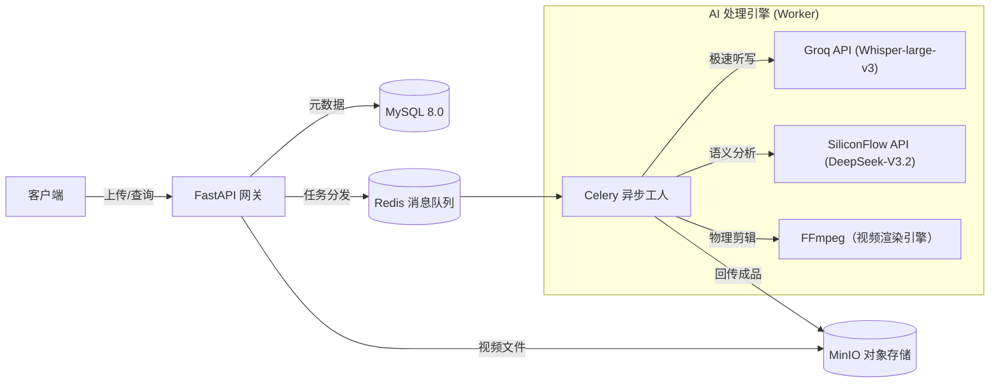

# 🎬 AI Intelligent Video Editor Backend (AI 智能视频剪辑后端)


> 针对【技术开发岗前测试题 1.2】提交的高性能解决方案。  
> 基于 **DeepSeek (LLM)** 和 **Groq Whisper (ASR)** 的全栈视频处理流水线。

---

## 📖 项目简介 (Introduction)

本项目实现了一个企业级的自动化视频剪辑系统。不同于传统的基于规则的剪辑，本项目利用 **大语言模型** 理解视频语义，自动识别并移除视频中的无效片段（如口语填充词、重复语句、静默片段）。

系统采用 **Producer-Consumer（生产者-消费者）** 异步架构设计，确保在高并发场景下 API 极速响应，并将耗时的视频处理任务卸载至后台 Worker 集群。

---

## ✨ 核心特性 (Key Features)

- ⚡ **极致性能 ASR**：弃用低效的本地 Whisper 模型，集成 Groq API（Whisper-large-v3），实现远超本地推理的语音转录速度，规避显存/算力瓶颈。
- 🧠 **智能语义分析**：接入 DeepSeek 系列大模型，理解上下文语义，智能去除“呃、那个”等口语废话。
- 🔄 **全异步处理**：基于 Celery + Redis 构建任务队列，支持任务状态轮询与失败重试。
- 🛡️ **工业级存储**：使用 MinIO 替代本地文件存储，模拟云原生生产环境（S3 协议）。
- 🧩 **健壮兜底策略**：当 AI 无法识别有效内容时自动降级处理，保证服务不中断。

---

## 🏗️ 系统架构 (Architecture)



> ✅ 说明：这里把你原来单独写的 `A -- 回传成品 --> minio[...]` 合并到了同一张架构图里，避免在一个 Mermaid 代码块里出现第二个 `flowchart/graph` 入口导致 GitHub 解析失败。

---

## 🛠️ 技术栈 (Tech Stack)

- **后端框架**：FastAPI, Uvicorn
- **异步队列**：Celery, Redis
- **数据库**：MySQL 8.0（SQLAlchemy ORM）
- **对象存储**：MinIO（S3 兼容）
- **AI 服务**：
  - ASR：Groq（Whisper-large-v3）
  - LLM：SiliconFlow（DeepSeek-V3.2）
- **视频处理**：FFmpeg, ffmpeg-python
- **部署**：Docker Compose

---

## 🚀 快速开始 (Quick Start)

### 1) 环境准备
确保本地已安装：
- Docker Desktop（或 Docker Engine）
- Python 3.10+

### 2) 启动基础设施（DB / Redis / MinIO）
```bash
docker compose up -d
# 如果你的环境仍使用旧命令：
# docker-compose up -d
```

### 3) 安装依赖
```bash
python -m venv venv

# Windows
.\venv\Scripts\activate

# macOS / Linux
# source venv/bin/activate

pip install -r requirements.txt
```

### 4) 配置环境变量
复制 `.env.example` 为 `.env` 并填入 API Key（示例）：

```env
# DeepSeek / SiliconFlow 配置
OPENAI_API_KEY=sk-xxxx
OPENAI_BASE_URL=https://api.siliconflow.cn/v1
LLM_MODEL_NAME=deepseek-ai/DeepSeek-V3.2

# Groq Whisper 配置（关键性能优化）
ASR_API_KEY=gsk_xxxx
ASR_API_BASE_URL=https://api.groq.com/openai/v1
ASR_MODEL_NAME=whisper-large-v3
```

### 5) 启动服务
建议打开两个终端窗口分别运行：

**窗口 1：Web API**
```bash
python main.py
# 服务运行在: http://127.0.0.1:8000
# 文档地址: http://127.0.0.1:8000/docs
```

**窗口 2：异步 Worker**
```bash
# Windows 必须加 --pool=solo
celery -A worker.tasks worker --loglevel=info --pool=solo
```

---

## 🧪 自动化测试 (E2E Test)

本项目包含一个端到端测试脚本，可自动验证“上传 -> 处理 -> 下载”全流程。  
确保根目录下存在 `test.mp4`，然后运行：

```bash
python test_e2e.py
```

---

## 💡 设计决策与优化 (Design Decisions)

### 1) 从本地模型迁移至云端 API
- **问题**：初始版本使用本地 whisper-small，显存占用高且长视频处理慢。
- **优化**：迁移至 Groq Whisper API，释放本地算力并显著提升转录吞吐，降低部署成本。

### 2) API 返回结构的鲁棒性处理
- **问题**：不同 AI 服务商 JSON 结构差异较大，部分字段缺失（如时间戳）。
- **优化**：编写适配器解析层，兼容 Object/Dict 多种结构，并增加无时间戳的兜底逻辑，避免任务崩溃。

### 3) Docker 化中间件
为保证开发环境与生产环境一致性，DB / Redis / MinIO 等有状态服务均通过 Docker Compose 编排。

---

## 📂 目录结构

```text
video-ai-backend/
├── api/                # 接口路由层
├── core/               # 核心业务 (AI Agent, Video Editor)
├── db/                 # 数据库模型与连接
├── worker/             # Celery 异步任务定义
├── main.py             # 程序入口
├── docker-compose.yml  # 基础设施编排
└── requirements.txt    # 依赖列表
```
